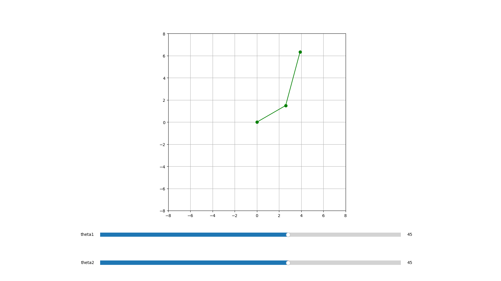

# 2D Robotic Arm Simulator
A Python simulation of a 2D robotic arm with interactive controls.
It demonstrates forward kinematics and the process of calculating 
the position of the end effector based on the joint angles.

Built with Python, NumPy and Matplotlib.

## Demo


## Installation
1. Clone the repository
```bash
git clone https://github.com/etienne1104-cmyk/robot-arm-simulator.git
cd robot-arm-simulator
```

2. Create a virtual environment
```bash
python -m venv venv
venv\Scripts\activate
```

3. Install dependencies
```bash
pip install -r requirements.txt
```
## Usage
```bash
python main.py
```
Use the sliders to control the angle of each arm segment.

## Concepts
- **Forward kinematics** — calculating the position of the end effector from joint angles
- **Trigonometry** — using cos/sin to convert angles into 2D coordinates